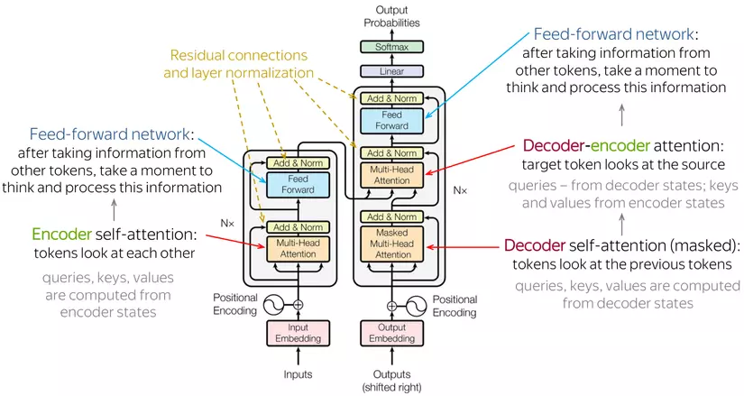

# RyuKenX Transformer

In this project, I meticulously designed a Machine Translation Engine specifically for Vietnamese, utilizing the robust Transformer Architecture. My main objective was to bridge theory with practice, ensuring that the implementation remains accessible and comprehensible to readers of the original paper. With this in mind, I dedicated myself to building and training the model from its fundamental architecture, aiming to provide clarity and ease of understanding throughout the process.
#### Attention Is All You Need Paper Implementation

> I've developed a custom implementation of the Transformer architecture outlined in the following research paper: [Vaswani, Ashish, et al. "Attention is all you need." Advances in neural information processing systems. 2017.](https://arxiv.org/abs/1706.03762)


**📝Author:**

- **Github:** [DSRoAI](https://github.com/DSRoAI) 🔗
- **Email:** nhhlong2004@gmail.com 📧
- **Facebook:** [Long Hoang](https://www.facebook.com/hoanglong.roai/) 👤
- **LinkedIn:** [Long Nguyen Huu Hoang](https://www.linkedin.com/in/long-nguy%E1%BB%85n-h%E1%BB%AFu-ho%C3%A0ng-023870287/) 💼

**⬆️ Upgrades:**
- ✅ Highly customizable configuration, training loop and validation loop.  
- ✅ Runnable on CPU and GPU.
- ✅ W&B integration for detailed logging of every metric.  
- ✅ Pretrained models and their training details.  
- ✅ Gradient Accumulation.  
- ✅ BPE and WordLevel Tokenizers.  
- ✅ Dynamic Batching and Batch Dataset Processing.  
- ✅ Bleu-score calculation during training and label smoothing.   
- ✅ Shown progress of translation for an example after every epoch.

> **If you find this repository helpful, please consider giving it a ⭐️!**

## Table of Contents
* [About](#about)
* [Setup](#setup)
  * [Environment](#environment)
  * [Pretrained Models](#pretrained-models)
* [Usage](#usage)
  * [Training](#training)
  * [Inference](#inference)
* [Data](#data)
* [Architecture](#architecture)
* [Weights and Biases Logs](#weights-and-biases-logs)
* [Citation](#citation)
* [License](#license)


# About
>*"We propose a new simple network architecture, the Transformer,
based solely on attention mechanisms, dispensing with recurrence and convolutions
entirely. " - Abstract*  
  
The advent of Transformers marked a monumental leap forward in neural network architectures, fundamentally reshaping the landscape of Natural Language Processing (NLP) and extending its impact far beyond. Among the myriad of transformative applications, consider the following few:
- **Language Translation:** 🌐
- **Text Generation:** 📝
- **Speech Recognition:** 🎤
- **Image Captioning:** 🖼️
- **Recommendation Systems:** 🛒
- **Question Answering:** ❓
- **Sentiment Analysis:** 😊
- **Code Generation:** 💻

# Data 
### Description
- **mt_eng_vietnamese:** This dataset is preprocessed from the IWSLT'15 English-Vietnamese machine translation corpus, tailored specifically for English-to-Vietnamese translation tasks. The dataset comprises approximately 135,856 pairs of sentences. However, if desired, you can manually adjust the dataset size to expedite result generation.

- Upon initiating training, the dataset undergoes automatic download, preprocessing, tokenization, and the creation of dataloaders. Additionally, a custom batch sampler is implemented to facilitate dynamic batching and padding of sentences with similar lengths, thereby enhancing training efficiency. These functionalities are facilitated by HuggingFace's datasets and tokenizers, ensuring swift processing.
### Data Instance
```
{
    'translation': 
    {
        'en': 'In 4 minutes , atmospheric chemist Rachel Pike provides a glimpse of the
        massive scientific effort behind the bold headlines on climate change , with her
        team -- one of thousands who contributed -- taking a risky flight over the
        rainforest in pursuit of data on a key molecule .', 

        'vi': 'Trong 4 phút , chuyên gia hoá học khí quyển Rachel Pike giới thiệu sơ lược
        về những nỗ lực khoa học miệt mài đằng sau những tiêu đề táo bạo về biến đổi khí
        hậu, cùng với đoàn nghiên cứu của mình -- hàng ngàn người đã cống hiến cho dự án
        này -- một chuyến bay mạo hiểm qua rừng già để tìm kiếm thông tin về một phân tử
        then chốt .'
    }
}
```
### Data Fields
- **en:** text in english
- **vi:** text in vietnamese
### Data Splits
- **Train Dataset:** 133318
- **Validation Dataset:** 1269
- **Test Dataset:** 1269


# Architecture 
This paper introduces the original transformer architecture, specifically designed with encoder and decoder components to address the seq2seq nature of machine translation tasks. While encoder-only (e.g., BERT) and decoder-only (e.g., GPT) transformer architectures exist, they won't be discussed here.

A key attribute of transformers, in general, is their ability to process sequences in parallel, a capability lacking in RNNs. Central to this advancement is the [attention mechanism](https://arxiv.org/abs/1409.0473), detailed in the paper "Attention is All You Need". This mechanism facilitates the creation of modified word representations, known as attention representations, which consider a word's significance within the context of other words in the sequence. For instance, the word "bank" can denote a financial institution or the land beside a river ("river bank"), depending on its context. This flexibility in representing words transcends the constraints of traditional word embeddings.

<a>
  <p align="center">
    
  </p>
</a>

# Setup

### Environment
**Using Miniconda/Anaconda:**
```
cd path_to_repo
conda env create transformer-env
conda activate transformer-env
```

***Note**: Depending on your GPU you might need to switch cudatoolkit to version 10.2*

### Pretrained Models
To download the pretrained model and tokenizer run:
```
python scripts/download_pretrained.py
```
You can see all the information and results for pretrained models at this [project link]().

# Usage

### Training 
Before starting training you can either **choose a configuration out of available ones or create your own** inside a single file `src/config.py`. The available parameters to customize, sorted by categories, are:

- **Run** 🚅:
   - RUN_NAME - Name of a training run
   - RUN_DESCRIPTION - Description of a training run
   - RUNS_FOLDER_PTH - Saving destination of a training run
- **Data** 🔡:
   - DATASET_SIZE - Number of examples you want to include from WMT14 en-de dataset (max 4,500,000)
   - TEST_PROPORTION - Test set proportion
   - MAX_LEN - Maximum allowed sequence length
   - VOCAB_SIZE - Size of the vocabulary (good choice is dependant on the tokenizer)
   - TOKENIZER_TYPE - 'wordlevel' or 'bpe'
- **Training** 🏋️‍♂️:
   - BATCH_SIZE - Batch size
   - GRAD_ACCUMULATION_STEPS - Over how many batches to accumulate gradients before optimizing the parameters
   - WORKER_COUNT - Number of workers used in dataloaders
   - EPOCHS - Number of epochs
- **Optimizer** 📉:
   - BETAS - Adam beta parameter
   - EPS - Adam eps parameter
- **Scheduler** ⏲️:
   - N_WARMUP_STEPS - How many warmup steps to use in the scheduler
- **Model** 🤖:
   - D_MODEL - Model dimension 
   - NUM_LAYERS - Number of encoder and decoder blocks
   - N_HEADS - Number of heads in the Multi-Head attention mechanism
   - D_FF - Dimension of the Position Wise Feed Forward network 
   - DROPOUT - Dropout probability
- **Local Path**:
    - PRETRAIN_MODEL_PTH - Path of pretrained model
    - PRETRAIN_TOKENIZER_PT - Path of pretrained tokenizer
    - SAVE_MODEL_DIR - Directory of saving model
    - TOKENIZER_SAVE_PTH - Path of saving tokenizer
- **Other** 🧰:
   - DEVICE - 'gpu' or 'cpu'
   - MODEL_SAVE_EPOCH_CNT - After how many epochs to save a model checkpoint
   - LABEL_SMOOTHING - Whether to apply label smoothing

Once you decide on the configuration **edit the config_name in train.py** and do:
```
$ cd src
$ python train.py
```
### Inference
To facilitate inference, I've developed a straightforward application using [Streamlit](https://streamlit.io/), which operates directly within your browser. Prior to using the app, ensure that you've either trained your models or downloaded pretrained ones. The application automatically searches the `model` directory for checkpoints of both the model and the tokenizer.
```
$ streamlit run app/inference_app.py
```


### Weights and Biases 
Utilizing [Weights and Biases](https://wandb.ai/site) significantly enhances MLOps capabilities. Integration with this project automates the generation of valuable logs and visualizations during training. To gain insights into the training process for pretrained models, visit the  [project link](). Real-time synchronization ensures that all logs and visualizations are seamlessly uploaded to the cloud.


When you start training you will be asked:
```
wandb: (1) Create W&B account
wandb: (2) Use an existing W&B account
wandb: (3) Don't visualize my results
wandb: Enter your choice: 
```

To create and synchronize visualizations with the cloud, you'll require a **W&B account**. The account setup process is quick, taking no more than a minute, and it's completely free. If you prefer not to visualize results, simply choose option 3.


## Citation
Please use this bibtex if you want to cite this repository:
```
@misc{RyuKenTransformerfromScratch,
  author = {Nguyễn Hữu Hoàng Long},
  title = {Transformer-from-Scratch},
  year = {2024},
  publisher = {GitHub},
  journal = {GitHub repository},
  howpublished = {\url{https://github.com/DSRoAI/Transformer-from-Scratch}},
}
```

## License
This repository is under an MIT License

[](https://github.com/DSRoAI/Transformer-from-Scratch/blob/main/LICENSE)


[def]: https://github.com/DSRoAI/Transformer-from-Scratch